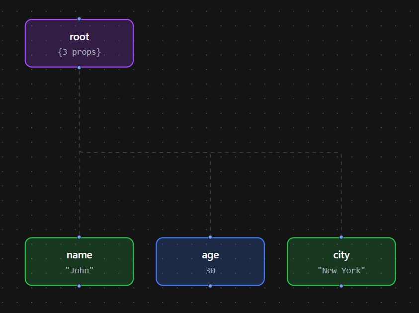

# JSON Visualizer

### Visualize JSON into tree structure.

### Live at https://visualizejson.netlify.app/

##### JSON

```
{
  "name": "John",
  "age": 30,
  "city": "New York"
}
```

##### JSON Tree Structure


